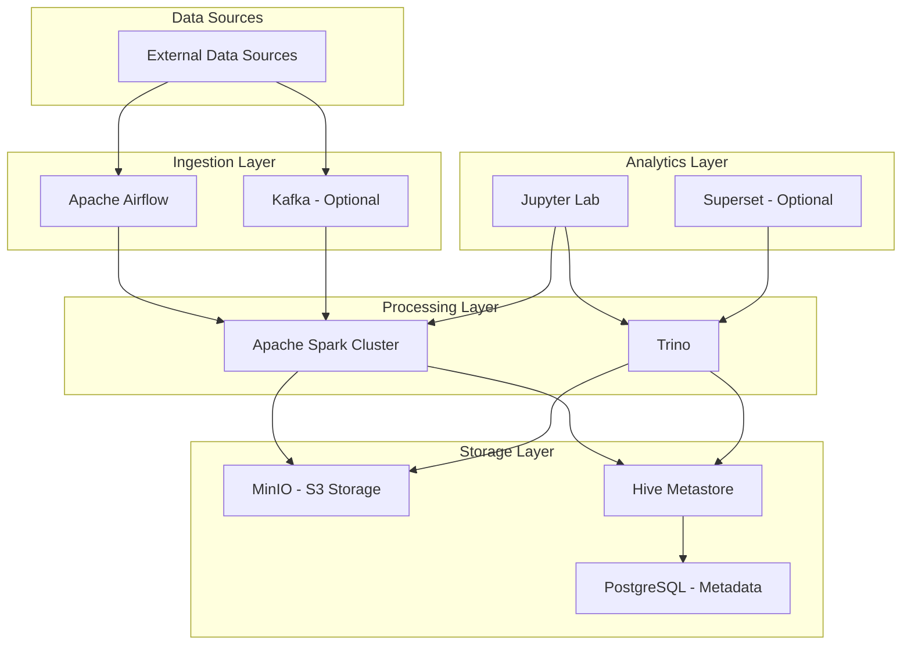

# 🚀 Modern Data Hub - Docker Compose Infrastructure

A production-ready, modular data platform built with Docker Compose, featuring Apache Spark, Airflow, Iceberg, Trino, and more.

## 📋 Table of Contents

- [Overview](#overview)
- [Architecture](#architecture)
- [Prerequisites](#prerequisites)
- [Quick Start](#quick-start)
- [Services](#services)
- [Configuration](#configuration)
- [Usage Examples](#usage-examples)
- [Development](#development)
- [Operations](#operations)
- [Troubleshooting](#troubleshooting)
- [Contributing](#contributing)
- [License](#license)

## 🎯 Overview

This Modern Data Hub provides a complete data platform infrastructure using Docker Compose with a modular architecture. Each component runs in its own container and can be scaled independently.

### Key Features

- ✅ **Modular Architecture**: Mix and match services based on your needs
- ✅ **Data Lakehouse**: Apache Iceberg with S3-compatible storage
- ✅ **Distributed Computing**: Apache Spark cluster with auto-scaling capability
- ✅ **Workflow Orchestration**: Apache Airflow for pipeline management
- ✅ **SQL Analytics**: Trino for fast SQL queries
- ✅ **Object Storage**: MinIO for S3-compatible storage
- ✅ **Interactive Development**: Jupyter Lab with PySpark
- ✅ **Production Ready**: Health checks, monitoring, and proper networking

## 🏗️ Architecture



## 📦 Prerequisites

### System Requirements

- **Docker**: Version 20.10 or higher
- **Docker Compose**: Version 2.0 or higher
- **Memory**: Minimum 8GB RAM (16GB recommended)
- **Storage**: Minimum 20GB free space
- **OS**: Linux, macOS, or Windows with WSL2

### Required Software

```bash
# Check Docker version
docker --version

# Check Docker Compose version
docker-compose --version

# Check available memory
docker system info | grep Memory
```

## 🚀 Quick Start

### 1. Clone the Repository

```bash
git clone https://github.com/your-org/modern-data-hub.git
cd modern-data-hub
```

### 2. Download Required JAR Files

```bash
# Create jars directory
mkdir -p jars

# Download Iceberg Spark runtime
wget -P jars/ https://repo1.maven.org/maven2/org/apache/iceberg/iceberg-spark-runtime-3.5_2.12/1.4.2/iceberg-spark-runtime-3.5_2.12-1.4.2.jar

# Download AWS SDK
wget -P jars/ https://repo1.maven.org/maven2/com/amazonaws/aws-java-sdk-bundle/1.12.367/aws-java-sdk-bundle-1.12.367.jar

# Download Hadoop AWS
wget -P jars/ https://repo1.maven.org/maven2/org/apache/hadoop/hadoop-aws/3.3.4/hadoop-aws-3.3.4.jar

# Download PostgreSQL JDBC
wget -P jars/ https://jdbc.postgresql.org/download/postgresql-42.5.1.jar
```

### 3. Create Directory Structure

```bash
# Create necessary directories
mkdir -p config/{airflow,spark,trino/catalog}
mkdir -p dags plugins notebooks scripts
mkdir -p data
```

### 4. Configure Environment Variables

```bash
# Copy the example environment file
cp .env.example .env

# Edit .env with your preferred settings
nano .env
```

### 5. Start All Services

```bash
# Start the entire stack
docker-compose \
  -f docker-compose.base.yml \
  -f docker-compose.postgres.yml \
  -f docker-compose.minio.yml \
  -f docker-compose.hive.yml \
  -f docker-compose.spark.yml \
  -f docker-compose.airflow.yml \
  -f docker-compose.trino.yml \
  -f docker-compose.jupyter.yml \
  up -d

# Check service status
docker-compose ps
```

### 6. Verify Installation

```bash
# Check if services are healthy
./scripts/health-check.sh

# Or manually check each service
curl http://localhost:8080  # Spark Master
curl http://localhost:8088  # Airflow
curl http://localhost:9001  # MinIO Console
```

## 🔧 Services

### Core Services

| Service | Port | URL | Default Credentials |
|---------|------|-----|---------------------|
| **PostgreSQL** | 5432 | `localhost:5432` | admin/admin123 |
| **MinIO Console** | 9001 | http://localhost:9001 | minioadmin/minioadmin123 |
| **MinIO API** | 9000 | http://localhost:9000 | minioadmin/minioadmin123 |
| **Spark Master** | 8080 | http://localhost:8080 | - |
| **Spark Worker 1** | 8081 | http://localhost:8081 | - |
| **Spark Worker 2** | 8082 | http://localhost:8082 | - |
| **Spark History** | 18080 | http://localhost:18080 | - |
| **Airflow** | 8088 | http://localhost:8088 | admin/admin |
| **Trino** | 8089 | http://localhost:8089 | - |
| **Jupyter Lab** | 8888 | http://localhost:8888 | Token: jupyter123 |
| **Hive Metastore** | 9083 | `localhost:9083` | - |

### Service Descriptions

#### **PostgreSQL**
Central metadata store for Airflow, Hive Metastore, and Trino catalogs.

#### **MinIO**
S3-compatible object storage for data lake operations, providing:
- Warehouse bucket for Iceberg tables
- Spark logs bucket for history server
- Airflow bucket for DAG artifacts
- Temp bucket for intermediate data

#### **Apache Spark**
Distributed computing cluster with:
- 1 Master node
- 2 Worker nodes (scalable)
- History Server for job monitoring
- Full Iceberg integration

#### **Apache Airflow**
Workflow orchestration with:
- LocalExecutor (upgradeable to Celery)
- Spark operator support
- S3 connection pre-configured

#### **Trino**
High-performance SQL query engine for:
- Iceberg table queries
- PostgreSQL federation
- Cross-datasource joins

#### **Jupyter Lab**
Interactive development environment with:
- PySpark pre-configured
- Direct Spark cluster access
- Shared workspace with other services

## ⚙️ Configuration

### Environment Variables

Create a `.env` file in the project root:

```bash
# PostgreSQL Configuration
POSTGRES_USER=admin
POSTGRES_PASSWORD=your_secure_password

# MinIO Configuration
MINIO_ACCESS_KEY=minioadmin
MINIO_SECRET_KEY=your_secure_password

# Airflow Configuration
AIRFLOW_UID=50000
AIRFLOW_USER=admin
AIRFLOW_PASSWORD=your_secure_password
AIRFLOW_FERNET_KEY=$(python -c "from cryptography.fernet import Fernet; print(Fernet.generate_key().decode())")
AIRFLOW_SECRET_KEY=$(openssl rand -hex 32)

# Jupyter Configuration
JUPYTER_TOKEN=your_secure_token

# Spark Configuration
SPARK_MODE=cluster
SPARK_WORKER_CORES=2
SPARK_WORKER_MEMORY=2g
```

### Spark Configuration

Edit `config/spark/spark-defaults.conf`:

```properties
spark.master                     spark://spark-master:7077
spark.eventLog.enabled           true
spark.eventLog.dir               s3a://spark-logs/
spark.history.provider           org.apache.spark.deploy.history.FsHistoryProvider

# Iceberg configurations
spark.sql.extensions             org.apache.iceberg.spark.extensions.IcebergSparkSessionExtensions
spark.sql.catalog.spark_catalog  org.apache.iceberg.spark.SparkSessionCatalog
spark.sql.catalog.iceberg        org.apache.iceberg.spark.SparkCatalog
spark.sql.catalog.iceberg.type   hive
spark.sql.catalog.iceberg.uri    thrift://hive-metastore:9083
spark.sql.defaultCatalog         iceberg

# S3 configurations
spark.hadoop.fs.s3a.endpoint     http://minio:9000
spark.hadoop.fs.s3a.access.key   minioadmin
spark.hadoop.fs.s3a.secret.key   minioadmin123
```

### Trino Catalogs

Configure Trino catalogs in `config/trino/catalog/`:

**iceberg.properties:**
```properties
connector.name=iceberg
hive.metastore.uri=thrift://hive-metastore:9083
hive.s3.endpoint=http://minio:9000
hive.s3.path-style-access=true
hive.s3.aws-access-key=minioadmin
hive.s3.aws-secret-key=minioadmin123
```

## 📚 Usage Examples

### Creating an Iceberg Table with Spark

```python
# In Jupyter or spark-submit
from pyspark.sql import SparkSession

spark = SparkSession.builder \
    .appName("IcebergExample") \
    .config("spark.sql.catalog.iceberg", "org.apache.iceberg.spark.SparkCatalog") \
    .config("spark.sql.catalog.iceberg.type", "hive") \
    .config("spark.sql.catalog.iceberg.uri", "thrift://hive-metastore:9083") \
    .getOrCreate()

# Create an Iceberg table
spark.sql("""
    CREATE TABLE IF NOT EXISTS iceberg.default.users (
        id BIGINT,
        name STRING,
        email STRING,
        created_at TIMESTAMP
    ) USING iceberg
    LOCATION 's3a://warehouse/users'
""")

# Insert data
spark.sql("""
    INSERT INTO iceberg.default.users VALUES
    (1, 'Alice', 'alice@example.com', current_timestamp()),
    (2, 'Bob', 'bob@example.com', current_timestamp())
""")
```

### Querying with Trino

```sql
-- Connect to Trino
-- docker exec -it data-hub-trino trino

-- Query Iceberg table
SELECT * FROM iceberg.default.users;

-- Time travel query
SELECT * FROM iceberg.default.users FOR VERSION AS OF 1;

-- Join with PostgreSQL data
SELECT u.*, p.department
FROM iceberg.default.users u
JOIN postgresql.public.profiles p ON u.id = p.user_id;
```

### Creating an Airflow DAG

```python
# Save in dags/example_pipeline.py
from airflow import DAG
from airflow.providers.apache.spark.operators.spark_submit import SparkSubmitOperator
from datetime import datetime, timedelta

default_args = {
    'owner': 'data-team',
    'depends_on_past': False,
    'start_date': datetime(2024, 1, 1),
    'email_on_failure': False,
    'email_on_retry': False,
    'retries': 1,
    'retry_delay': timedelta(minutes=5),
}

dag = DAG(
    'example_spark_pipeline',
    default_args=default_args,
    description='Example Spark Pipeline',
    schedule_interval=timedelta(days=1),
    catchup=False,
)

spark_job = SparkSubmitOperator(
    task_id='run_spark_job',
    application='/opt/workspace/jobs/etl_job.py',
    conn_id='spark_default',
    conf={
        'spark.sql.catalog.iceberg': 'org.apache.iceberg.spark.SparkCatalog',
        'spark.sql.catalog.iceberg.type': 'hive',
        'spark.sql.catalog.iceberg.uri': 'thrift://hive-metastore:9083',
    },
    dag=dag,
)
```

## 🛠️ Development

### Adding New Services

1. Create a new compose file: `docker-compose.newservice.yml`
2. Add service configuration following the existing pattern
3. Update the base network configuration if needed
4. Test the service independently
5. Document the service in this README

### Scaling Workers

```bash
# Scale Spark workers
docker-compose -f docker-compose.spark.yml up -d --scale spark-worker=3

# Scale Airflow workers (if using CeleryExecutor)
docker-compose -f docker-compose.airflow.yml up -d --scale airflow-worker=3
```

### Custom Configurations

Place custom configurations in:
- `config/airflow/airflow.cfg` - Airflow settings
- `config/spark/` - Spark configurations
- `config/trino/` - Trino catalogs and settings

## 🔧 Operations

### Backup and Restore

#### Backup PostgreSQL

```bash
# Backup all databases
docker exec data-hub-postgres pg_dumpall -U admin > backup_$(date +%Y%m%d).sql

# Backup specific database
docker exec data-hub-postgres pg_dump -U admin airflow > airflow_backup.sql
```

#### Backup MinIO Data

```bash
# Using MinIO client
docker run --rm -v minio-data:/data \
    -v $(pwd)/backups:/backup \
    alpine tar czf /backup/minio_backup_$(date +%Y%m%d).tar.gz /data
```

### Monitoring

#### Check Service Health

```bash
# Quick health check
./scripts/health-check.sh

# Detailed status
docker-compose ps
docker stats --no-stream

# Check logs
docker-compose logs -f spark-master
docker-compose logs --tail=100 airflow-scheduler
```

#### Resource Usage

```bash
# Monitor resource usage
docker stats

# Check disk usage
docker system df
du -sh data/*
```

### Maintenance

#### Clean Up

```bash
# Stop all services
docker-compose down

# Remove volumes (WARNING: Deletes all data)
docker-compose down -v

# Clean up unused resources
docker system prune -a
docker volume prune
```

#### Update Services

```bash
# Pull latest images
docker-compose pull

# Recreate services with new images
docker-compose up -d --force-recreate
```

## 🐛 Troubleshooting

### Common Issues

#### 1. Services Not Starting

```bash
# Check logs
docker-compose logs service-name

# Check if ports are already in use
netstat -tulpn | grep PORT_NUMBER

# Verify environment variables
docker-compose config
```

#### 2. Out of Memory

```bash
# Increase Docker memory allocation
# Docker Desktop: Settings > Resources > Memory

# Or adjust service memory limits in compose files
environment:
  SPARK_WORKER_MEMORY: 1g  # Reduce from 2g
```

#### 3. Connection Issues

```bash
# Verify network
docker network inspect data-hub-network

# Test connectivity between containers
docker exec spark-master ping postgres

# Check DNS resolution
docker exec spark-master nslookup postgres
```

#### 4. Spark Job Failures

```bash
# Check Spark logs
docker logs data-hub-spark-master
docker logs data-hub-spark-worker-1

# Access Spark UI
open http://localhost:8080

# Check History Server
open http://localhost:18080
```

#### 5. Airflow Issues

```bash
# Reset Airflow database
docker exec data-hub-airflow-webserver airflow db reset

# Create admin user manually
docker exec -it data-hub-airflow-webserver \
    airflow users create \
    --username admin \
    --password admin \
    --firstname Admin \
    --lastname User \
    --role Admin \
    --email admin@example.com
```

### Getting Help

1. Check service logs: `docker-compose logs -f [service-name]`
2. Review configuration files in `config/`
3. Verify environment variables in `.env`
4. Check service health endpoints
5. Review [Issues](https://github.com/your-org/modern-data-hub/issues) on GitHub

## 📊 Performance Tuning

### Spark Optimization

```bash
# Adjust in docker-compose.spark.yml
SPARK_WORKER_CORES: 4  # Increase cores
SPARK_WORKER_MEMORY: 4g  # Increase memory
```

### PostgreSQL Tuning

```sql
-- Add to scripts/init-postgres.sh
ALTER SYSTEM SET shared_buffers = '256MB';
ALTER SYSTEM SET work_mem = '4MB';
ALTER SYSTEM SET maintenance_work_mem = '64MB';
ALTER SYSTEM SET effective_cache_size = '1GB';
```

### MinIO Performance

```yaml
# In docker-compose.minio.yml
environment:
  MINIO_CACHE: "on"
  MINIO_CACHE_DRIVES: "/cache"
  MINIO_CACHE_EXCLUDE: "*.pdf"
  MINIO_CACHE_QUOTA: 80
```

## 🔒 Security

### Production Recommendations

1. **Change all default passwords** in `.env`
2. **Enable SSL/TLS** for all services
3. **Use secrets management** (Docker Secrets, Vault)
4. **Implement network policies**
5. **Enable authentication** for all UIs
6. **Regular security updates**
7. **Implement RBAC** for Airflow and Trino
8. **Enable audit logging**

### SSL Configuration Example

```yaml
# Add to service configuration
environment:
  AIRFLOW__WEBSERVER__WEB_SERVER_SSL_CERT: /certs/cert.pem
  AIRFLOW__WEBSERVER__WEB_SERVER_SSL_KEY: /certs/key.pem
volumes:
  - ./certs:/certs:ro
```

## 🤝 Contributing

We welcome contributions! Please follow these steps:

1. Fork the repository
2. Create a feature branch (`git checkout -b feature/amazing-feature`)
3. Commit your changes (`git commit -m 'Add amazing feature'`)
4. Push to the branch (`git push origin feature/amazing-feature`)
5. Open a Pull Request

### Development Setup

```bash
# Clone your fork
git clone https://github.com/your-username/modern-data-hub.git

# Add upstream remote
git remote add upstream https://github.com/original-org/modern-data-hub.git

# Create development branch
git checkout -b feature/your-feature

# Make changes and test
docker-compose up -d
# Test your changes

# Commit and push
git add .
git commit -m "Description of changes"
git push origin feature/your-feature
```

## 📄 License

This project is licensed under the MIT License - see the [LICENSE](LICENSE) file for details.

## 🙏 Acknowledgments

- Apache Spark, Airflow, and Iceberg communities
- Trino and MinIO teams
- Docker and Docker Compose maintainers
- All contributors to this project

## 📞 Support

- 📧 Email: support@your-org.com
- 💬 Slack: [Join our Slack](https://slack.your-org.com)
- 🐛 Issues: [GitHub Issues](https://github.com/your-org/modern-data-hub/issues)
- 📖 Docs: [Documentation](https://docs.your-org.com)

---

**Built with ❤️ by the Data Platform Team**